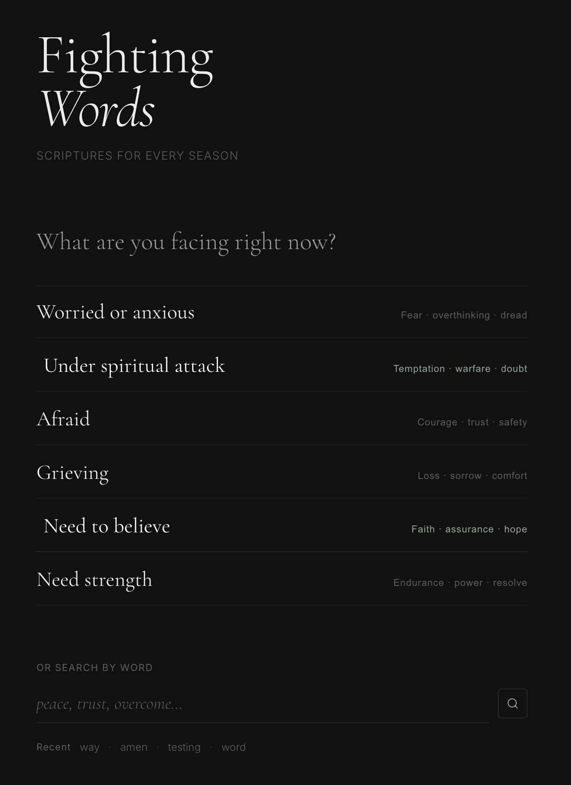

# Design Guidelines

This version strips everything back to type and space. Key decisions:

Typography — Cormorant Garamond for all display text (wordmark, prompt, chip labels, verse body). It's an editorial serif that carries weight without heaviness — right for something spiritual and serious. Inter only for utilitarian text: labels, tags, recents.

Color — single white with descending opacity levels (0.92 → 0.58 → 0.32 → 0.18). No warm tones competing. The only accent is a muted sage-grey-green — just enough to identify verse references and active states without drawing attention to itself.

Chips as a list — no cards, no borders, no backgrounds. Just serif text rows with a hairline rule. Hover slides the row right 8px. The sub-labels use · separators instead of commas — quieter, more intentional.

Search — underline only, italic placeholder in Cormorant. Feels like an open field to write into, not a UI widget.

Verses — italic serif body, uppercase reference in accent color, muted tag beneath. Clean enough to actually read in a difficult moment.
